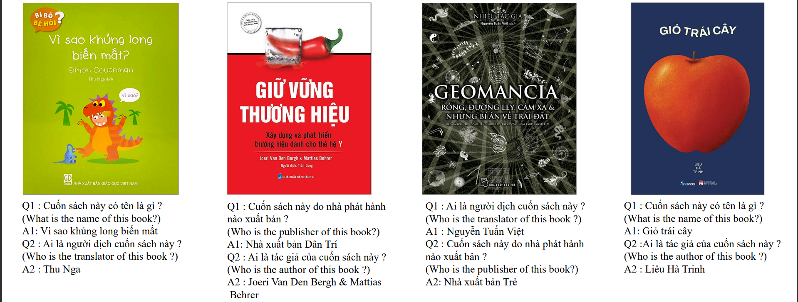

ViOCRVQA: Vietnamese Optical Character Recognition - Visual Question Answering
=====

# ViOCRVQA Dataset

Welcome to ViOCRVQA (Vietnamese Optical Character Recognition - Visual Question Answering ) dataset! This dataset is the largest scale dataset in Vietnamese specializing in understanding text appearing in images.

## Overview

ViOCRVQA contains over consisting of 28,000+ images and 120,000+ question-answer pairs. In this dataset, all the images contain
text and questions about the information relevant to the text in the images.

## Purpose

The purpose of ViOCRVQA is to provide a benchmark for evaluating the reading comprehension ability of Visual Question Answering (VQA) models in the Vietnamese language. As a developing country, Vietnam is still in need of resources and benchmarks to advance research in AI and machine learning.

## Key Features

- 28,282 images
- 123,781 questions with answers
- Focus on understanding text within images
- Meticulously crafted to ensure diverse and challenging questions

## Importance of ViOCRVQA

Understanding text in images is crucial for many real-world applications, such as assisting the visually impaired, enhancing image search engines, and improving AI understanding of multimedia content. convenient. ViOCRVQA fills an important gap by providing the largest-scale dataset relevant to Vietnamese.

## Usage

Researchers and developers can use ViOCRVQA to train and evaluate their VQA models, analyze the performance of different approaches, and contribute to advancing research in this field. The dataset is freely available for research purposes.

## Contributions
- Create the largest-scale dataset for text-based VQA tasks in Vietnamese, focusing on text appearing in images.

- Analyze the challenge of the ViOCRVQA dataset by evaluating the performance of the OCR system.

- Through extensive testing, we found that the VQA models used for English are not really effective on Vietnamese. We recommend our proposed VisionReader model

- Our experiments demonstrate the effectiveness of building relationships between objects and text information in images.

## Availability

The ViOCRVQA dataset will be available for download after our article is accepted.

You can find it at the following link: [ViOCRVQA Dataset](link)

## Citation

If you use ViOCRVQA dataset in your research, please cite our paper (preprint):

[ViOCRVQA](https://arxiv.org/abs/2404.18397)

## Authors
- Huy Quang Pham
  - Email: [21522163@gm.uit.edu.vn](mailto:21522163@gm.uit.edu.vn)

- Thang Kien-Bao Nguyen
  - Email: [21521432@gm.uit.edu.vn](mailto:21521432@gm.uit.edu.vn)

- Quan Van Nguyen
  - Email: [215622163@gm.uit.edu.vn](mailto:215622163@gm.uit.edu.vn)

- Dan Quang Tran
  - Email: [21521917@gm.uit.edu.vn](mailto:21521917@gm.uit.edu.vn)

- BS Nghia Hieu Nguyen
  - Email: [nghiangh@uit.edu.vn](mailto:nghiangh@uit.edu.vn)

- MSc Kiet Van Nguyen
  - Email: [kietnv@uit.edu.vn](mailto:kietnv@uit.edu.vn)

- Assoc. Prof Ngan Luu-Thuy Nguyen
  - Email: [ngannlt@uit.edu.vn](mailto:ngannlt@uit.edu.vn)

### Affiliations

- Faculty of Information Science and Engineering, University of Information Technology
- Vietnam National University, Ho Chi Minh City, Vietnam

## Contact

For any inquiries or feedback regarding the ViOCRVQA dataset, please contact  [21522163@gm.uit.edu.vn](mailto:215622163@gm.uit.edu.vn).

Thank you for your interest in ViOCRVQA! We hope this dataset contributes to the advancement of research in text-based Visual Question Answering around the world, especially in Vietnam.